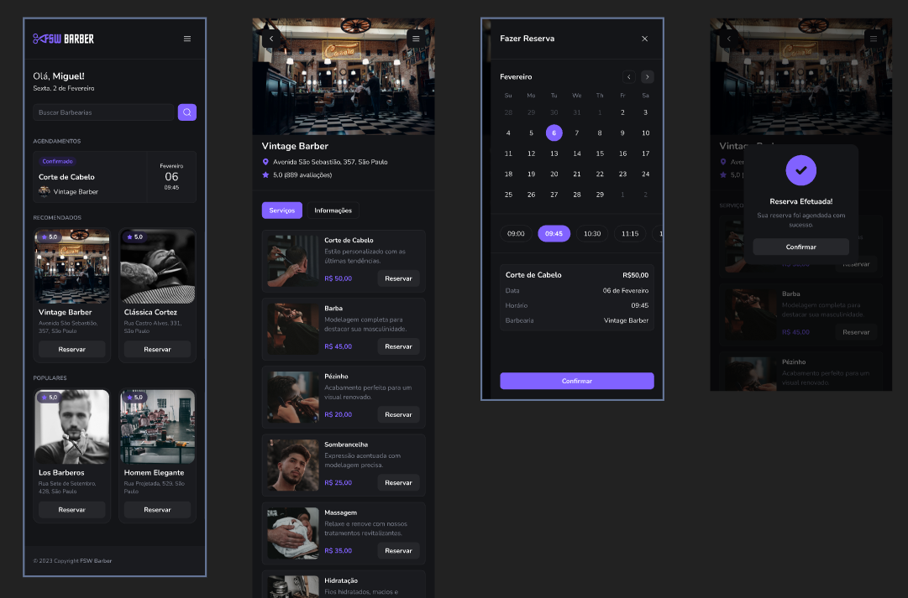

<h1 align="center">barbershop</h1>

  <a href="#-tecnologias">Tecnologias</a>&nbsp;&nbsp;&nbsp;|&nbsp;&nbsp;&nbsp;
  <a href="#-projeto">Projeto</a>&nbsp;&nbsp;&nbsp;|&nbsp;&nbsp;&nbsp;
  <a href="#-como-executar">Como executar</a>&nbsp;&nbsp;&nbsp;|&nbsp;&nbsp;&nbsp;
  <a href="#-saiba-mais">Saiba mais</a>&nbsp;&nbsp;&nbsp;|&nbsp;&nbsp;&nbsp;
  <a href="#-licença">Licença</a>

  

 

## ✨ Tecnologias

Esse projeto foi desenvolvido com as seguintes tecnologias:

- [Next.js 14 com TypeScript](https://nextjs.org)
- [Tailwind](https://tailwindui.com/)
- [Shadcn/ui](https://ui.shadcn.com/)
- [Prisma](https://www.prisma.io/x)

## 💻 Projeto

Um sistema de reservas para barbearias;

## 🚀 Como executar

Para iniciar o seu projeto.

- Instale as dependências com `npm install ou yarn add`
- Rode o baco de dados com docker `docker-compose up -d`
- Crie o banco de dados e rode as migrations rodando `npx prisma migrate dev && npm run seed`
- Inicie o projeto com `npm run dev`

Agora você pode acessar [`localhost:3000`](http://localhost:3000) do seu navegador.

## ⚡️ Saiba mais

- Figma: [https://www.figma.com/file/TJquYVeL0si5dpXxJNtPkM/FSW-Barber-%5BLive%5D?type=design&node-id=1-9&mode=design&t=wpFHpeOScldE6lWW-0](https://www.figma.com/file/TJquYVeL0si5dpXxJNtPkM/FSW-Barber-%5BLive%5D?type=design&node-id=1-9&mode=design&t=wpFHpeOScldE6lWW-0/)
- Notion: [https://narrow-beach-a00.notion.site/Full-Stack-Week-3-Edi-o-f633d6a03555413e874a5e826bbaaf35](https://narrow-beach-a00.notion.site/Full-Stack-Week-3-Edi-o-f633d6a03555413e874a5e826bbaaf35)

## 📄 Licença

Esse projeto está sob a licença MIT. Veja o arquivo [LICENSE](LICENSE.md) para mais detalhes.

---

Feito com ♥ by Pedro;
